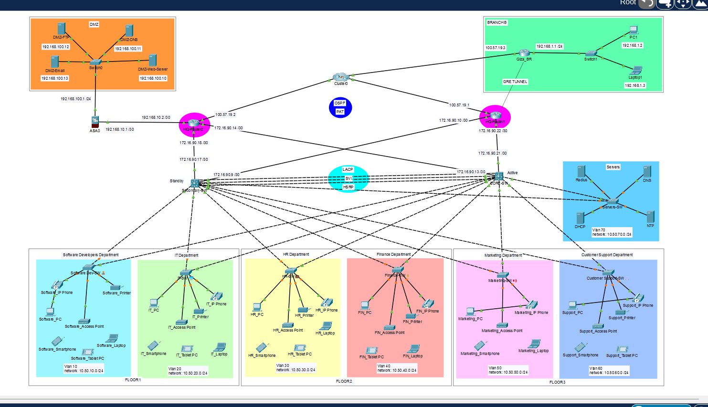

# 🚀 Enterprise Network Architecture & Security Implementation

[](https://www.netacad.com/)
[](https://www.cisco.com/)
[](https://www.cisco.com/)

An end-to-end, multi-site enterprise network designed, configured, and simulated using **Cisco Packet Tracer**. This project links the **Main HQ** with the **Giza Branch** (`BRANCH B`) through a redundant, high-availability, highly segmented, and secure network infrastructure.

---

## 📋 Table of Contents
- [Project Overview](#-project-overview)
- [Network Topology](#-network-topology)
- [Technologies Implemented](#-technologies-implemented)
- [VLAN & IP Addressing Scheme](#-vlan--ip-addressing-scheme)
- [High Availability & HSRP Redundancy](#-high-availability--hsrp-redundancy)
- [Routing & Site-to-Site GRE Tunnel](#-routing--site-to-site-gre-tunnel)
- [Perimeter Security & DMZ Architecture](#-perimeter-security--dmz-architecture)
- [Centralized AAA & RADIUS Authentication](#-centralized-aaa--radius-authentication)
- [Core Services & IP Telephony (CME)](#-core-services--ip-telephony-cme)
- [Verification & Proof of Concepts](#-verification--proof-of-concepts)
- [How to Run the Project](#-how-to-run-the-project)
- [Author](#-author)

---

## 📋 Project Overview

This project simulates a fully functional multi-site enterprise network adhering to Cisco enterprise architecture standards. It implements a **Hierarchical Three-Tier Model (Core, Distribution, Access)** at HQ connected to a remote branch (**Giza Branch / BRANCH B**) over a simulated WAN.

Key focus areas include **L2/L3 Redundancy (HSRP Active/Standby, LACP EtherChannel, SVI)**, **Perimeter Defense (Cisco ASA Firewall, Isolated DMZ)**, **Centralized Identity Control (RADIUS AAA Server)**, and **Unified Communications (Cisco CallManager Express VoIP)**.

---

## 🖧 Network Topology

The network is logically and physically partitioned into specialized zones:
- **Inside LAN (HQ Floors 1–3):** Departmental VLANs terminating on Core/Distribution L3 switches.
- **Central Infrastructure Zone (Servers):** Dedicated VLAN 70 hosting DHCP, DNS, NTP, and RADIUS security servers.
- **DMZ Zone:** Isolated zone behind the Cisco ASA Firewall holding external-facing Web, DNS, FTP, and Mail servers.
- **Branch Office (Giza_BR):** Connected through a site-to-site GRE tunnel over WAN.

📸 **Network Topology Diagram:**


---

## ⚙️ Technologies Implemented

| Domain | Technologies & Protocols | Description |
| :--- | :--- | :--- |
| **Architecture** | Three-Tier Model | Core Layer, Distribution Layer, and Access Layer hierarchy |
| **IP Addressing** | VLSM (Classless IPv4) | Structured subnetting across HQ departments and branch subnets |
| **L2 Switching** | VLANs, Trunking, LACP, SVI | Logical isolation, EtherChannel aggregation, and switch virtual interfaces |
| **L3 Redundancy** | HSRP (Hot Standby Router Protocol) | Gateway redundancy between `CORE` (Active) and `Secondary` (Standby) |
| **Routing & WAN** | Single-Area OSPF (Area 0) & GRE Tunnel | Dynamic IP routing and site-to-site WAN encapsulation |
| **Security & DMZ** | Cisco ASA 5506-X, Stateful Firewall, DMZ | Perimeter defense with stateful packet inspection and security zones |
| **Identity Control** | AAA with RADIUS Authentication | Centralized administrative user access control for Core infrastructure |
| **Core Services** | Centralized DHCP Relay, DNS, NTP | Centralized dynamic address allocation, name resolution, and clock sync |
| **Voice Over IP** | Cisco CME & Dedicated Voice VLAN 88 | IP Telephony with extension dialing across 7960 series IP phones |

---

## 📐 VLAN & IP Addressing Scheme

### **Main HQ Departmental VLANs (`10.50.0.0/16`)**

| Floor | VLAN ID | Department / Name | Network Subnet | Virtual Gateway (VIP) | Active L3 Switch | Standby L3 Switch |
| :---: | :---: | :--- | :--- | :---: | :---: | :---: |
| **Floor 1** | **10** | Software Developers | `10.50.10.0/24` | `10.50.10.1` | `10.50.10.2` | `10.50.10.3` |
| **Floor 1** | **20** | IT Department | `10.50.20.0/24` | `10.50.20.1` | `10.50.20.2` | `10.50.20.3` |
| **Floor 2** | **30** | HR Department | `10.50.30.0/24` | `10.50.30.1` | `10.50.30.2` | `10.50.30.3` |
| **Floor 2** | **40** | Finance Department | `10.50.40.0/24` | `10.50.40.1` | `10.50.40.2` | `10.50.40.3` |
| **Floor 3** | **50** | Marketing Department | `10.50.50.0/24` | `10.50.50.1` | `10.50.50.2` | `10.50.50.3` |
| **Floor 3** | **60** | Customer Support | `10.50.60.0/24` | `10.50.60.1` | `10.50.60.2` | `10.50.60.3` |
| **Infra** | **70** | Central Servers | `10.50.70.0/24` | `10.50.70.1` | `10.50.70.2` | `10.50.70.3` |
| **Voice** | **88** | IP Telephony (Voice) | `10.50.88.0/24` | `10.50.88.1` | `10.50.88.2` | `10.50.88.3` |

### **DMZ Infrastructure (`192.168.100.0/24`)**
- **ASA DMZ Gateway:** `192.168.100.1/24`
- **DMZ-Web-Server:** `192.168.100.10`
- **DMZ-DNS:** `192.168.100.11`
- **DMZ-FTP:** `192.168.100.12`
- **DMZ-Email:** `192.168.100.13`

### **Giza Branch (`BRANCH B`) Subnet (`192.168.1.0/24`)**
- **Branch Gateway (`Giza_BR`):** `192.168.1.1/24`
- **Clients (`PC1`, `Laptop1`):** `192.168.1.2` – `192.168.1.3`

---

## 🔄 High Availability & HSRP Redundancy

HSRP Grouping is deployed across `CORE` and `Secondary` Layer 3 switches to ensure continuous gateway availability across all internal VLANs (10–88).

```cisco
! Active Core Switch Configuration Example (VLAN 10)
interface Vlan10
 ip address 10.50.10.2 255.255.255.0
 standby 10 ip 10.50.10.1
 standby 10 priority 110
 standby 10 preempt

! Standby Secondary Switch Configuration Example (VLAN 10)
interface Vlan10
 ip address 10.50.10.3 255.255.255.0
 standby 10 ip 10.50.10.1
 standby 10 priority 100
